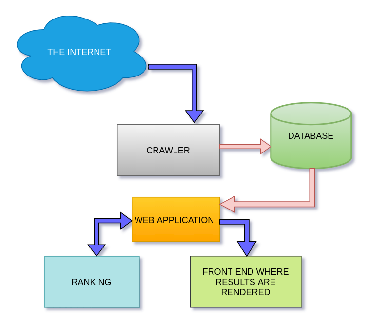

# Glugle

## About the project:

Glugle is a fully functional search engine made using Python Programming Language. It displays search results based on a textual search query. MongoDB is used as database in the project. Several python libraries including BeautifulSoup, Pymongo and Requests are utilized and the web application is created using Flask. 

## Project Architecture:

## Tech stacks used:

- Python programming language
- MongoDB
- Flask

## Aim:

- Crawling the web and indexing data in the database.
- Find results based on a search query.
- Display search results in a systematic and efficent manner by applying ranking algorithms.