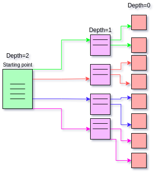

# WEB CRAWLER
The word “crawler” itself can be intimidating to many people but it is basically a script having a few lines of code.

  

A web crawler, spider, or search engine bot downloads and indexes content from all over the Internet. They're called `web crawlers` because crawling is the technical term for automatically accessing a website and obtaining data via a software program.

The crawler goes from page to page and stores the data fetched from it in the database, so that the information can be retrieved when it's needed.

## APPROACH TO BUILD THE CRAWLER

- We are going to use the following python libraries to achieve the task

	1. `requests` library to fetch the pages.

	2. `beautifulsoup4` to parse the response received from the response object.

	3. `pymongo` to connect to mongodb where we are going to store the data.

- **Yes that’s it, that’s all we need.**

- We will build a **python class named `Crawler`** inside the `crawler.py` file.

- The first thing we want to do is to make a connection with our database using “pymongo” library.
  
	`python
	client = pymongo.MongoClient(connect_url_to_mongodb)
	`
> Note that if you are running mongodb on your computer your connection url would be `mongodb://127.0.0.1:27017/` as mongodb runs on port 27017 by default.

- After the connection is made we are going to define two methods inside the class “Crawler” named `start_crawling` and `crawl`.

- Both of the methods mentioned above are going to take two arguments:

- `url` (string containing the url to the page we want to parse)

- `depth`(integer parameter to control the number of pages your program crawls)

   

  

### THE `start_crawl` FUNCTION

This function starts the process of crawling. It performs the task of collecting the links in robots.txt and storing them in a list named “disallowed_links”.
> **How to connect to url using requests and get data from desired tags**
```python
import urllib.parse
complete_url = urllib.parse.join(domain_name, '/path')
response = requests.get(complete_url)
```
> *try to figure out the problem which arises if you don't use **urllib.parse.join()**.*

> *The response obtained is then processed using beautifulsoup. Example of how data is obtained using beautifulsoup is given below.*

```python
import requests
from bs4 import BeautifulSoup

URL = "https://exampleurl.com/userinfo/"
page = requests.get(URL)

soup = BeautifulSoup(page.content, "html.parser")
results = soup.find('class_name').text
```


The `url`, `depth` and `disallowed_links` are then passed to the crawl function where the actual process of crawling begins.

**Note that some urls may not have any robots.txt file so, use a try except block while looking for robots.**

  

## THE `crawl` FUNCTION


This is the function where most of the things are done. First we define it with the parameters `url`, `depth` and `disallowed_links`. Then inside the function the following takes place.

- It tries to connect to the provided url using the `requests` library.

- If request returns a response it parses the content returned from the first step using the `Beautifulsoup` library and looks for *`title`* tags and *`p`*  tags which it saves in the title and description variables respectively.

- After completion of all the above steps it creates a dictionary named “query”with url, title and description in it which will be saved in the database.

```python
query = {

	‘url’ : url,

	‘title’ : title,

	‘description’ : description
   }
```

- This query is saved in the database using [insert_one](https://docs.mongodb.com/manual/reference/method/db.collection.insert/) method for mongodb.

- Next it checks if `depth` is equal to zero or not. If it is zero the functions stops, else it collects all the links present in the page using `Beautifulsoup` and stores them in a list named `links`

- It then loops through all the links and for each link it calls the `*crawl*` with the depth variable decremented by one like this:

```python
self.crawl(link, depth-1)
```

- Atlast it closes the connection it made with the database using *.close()* method.
  

## Packages used in making the crawler

  

The packages can be installed using `pip install package-name`

The packages used are **BeautifulSoup, urllib, request and pymongo.**

  

- [Beautiful Soup Documentation](https://www.crummy.com/software/BeautifulSoup/bs4/doc/)

  

- [urllib python documentation](https://docs.python.org/3/library/urllib.html)

  

- [Request python documentation](https://docs.python-requests.org/en/latest/)

  

- [Pymongo python documentation](https://pymongo.readthedocs.io/en/stable/)

  

Use **mongodb** to store data retrieved from the crawler.

# Task

Now it's time for you to create your own crawler using the instructions given above and make it crawl on some of the domains.
(You can always start by crawling the wikipedia homepage.)