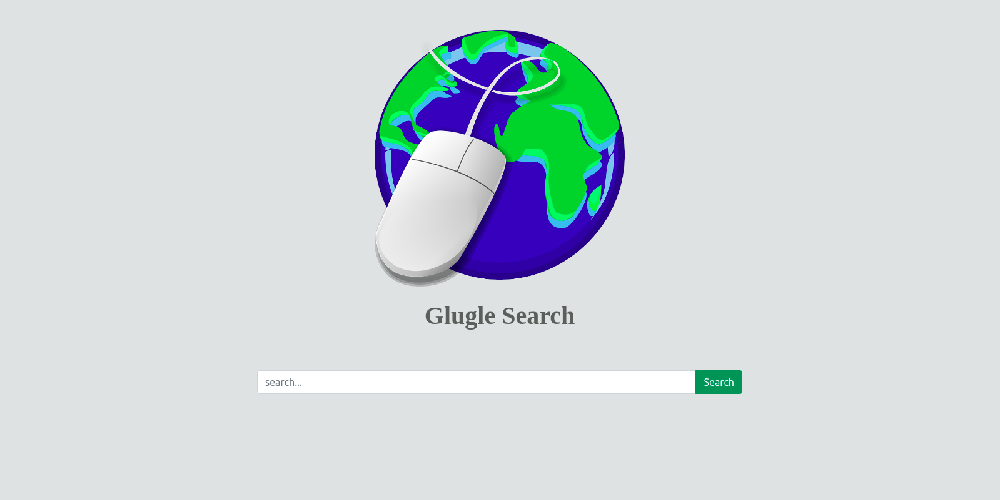
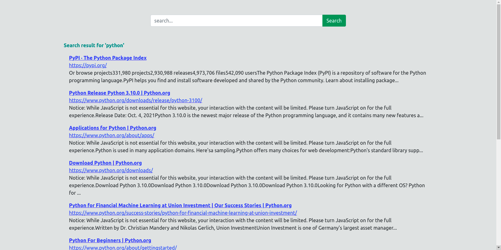

# **FLASK GUIDE**

Flask is a **python web framework** that helps in creating web applications. Although flask is a vast topic, in this article we are going to learn the part of flask which we require for building our project.

## Installation

Install flask in your system using

```python
pip install flask
```

## A Minimal Flask app

A minimal Flask application looks something like this:

```python
# an object of WSGI application

from flask import Flask	
app = Flask(__name__) # Flask constructor

# A decorator used to tell the application
# which URL is associated function
@app.route('/')	
def hello():
	return 'HELLO'

if __name__=='__main__':
app.run()
```
The function returns the message we want to display in the user’s browser. The default content type is HTML, so HTML in the string will be rendered by the browser.
 
## Running the App
Save the file as hello.py or something similar. Make sure to not call your application flask.py because this would conflict with Flask itself.
Run the application by flask run command.

## Routing

Nowadays, the web frameworks provide routing techniques so that users can remember the URLs. It is useful to access the web page directly without navigating from the Home page. It is done through the following route() decorator, to bind the URL to a function.

## Decorator to route URL
```python
@app.route(‘/hello’)
```

## Binding to the function of route
```python
def hello_world():	
 return ‘hello world’
```

If a user visits ```http://localhost:5000/hello``` URL, the output of the hello_world() function will be rendered in the browser. The ```add_url_rule()``` function of an application object can also be used to bind a URL with the function as in the above example.


# Task

1. Make a flask application which takes 2 number as input in a form and displays their sum.
2. Design the frontend for your application.
	- A sample frontend for your application is given below
  
  
