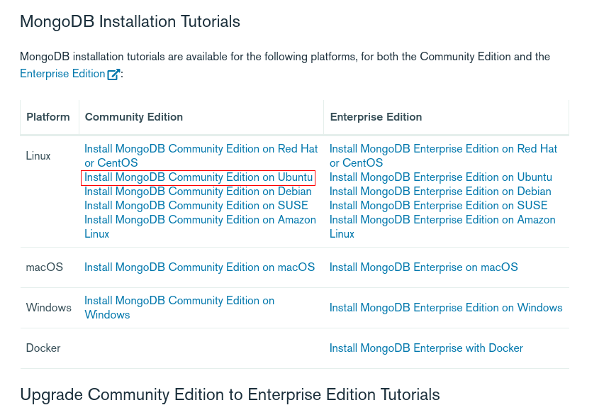
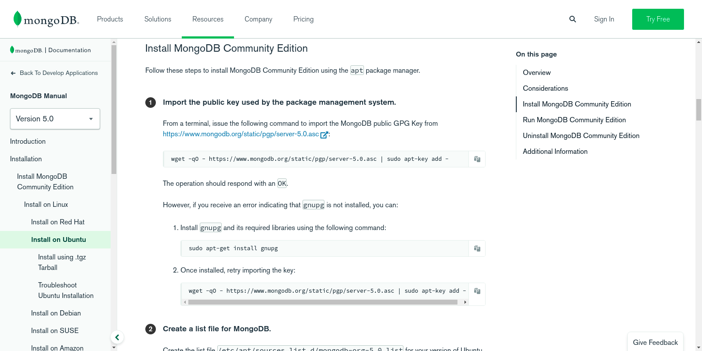
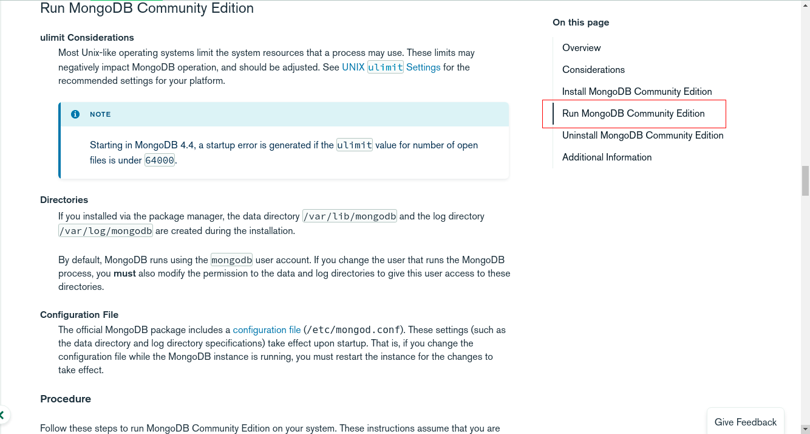

# **MongoDb installation Linux (Ubuntu)**

We are going to install and run mongodb in our local systems. For doing that follow the below instructions.

1. Head over to https://docs.mongodb.com/manual/installation/

2. Click on Install MongoDB Community Edition on Ubuntu.

3. Follow the instructions given in the page to install mongodb on your computer.

4. Run the installed mongodb by following the instructions on clicking here.

