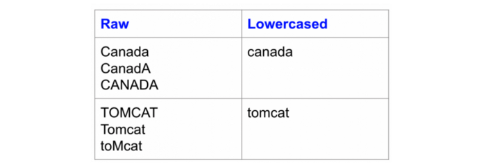
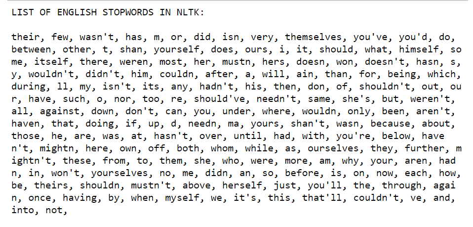
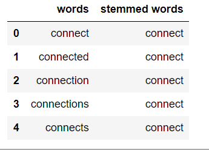

# **Query Preprocessing**

To preprocess your text simply means to bring your text into a form that is predictable and analyzable for your task. Whenever we have textual data, we need to apply several pre-processing steps to the data to transform words into numerical features that work with machine learning algorithms.

For preprocessing in python, we will be using NLTK(Natural Language Toolkit), string and regex packages.

### **Basic Preprocessing Techniques**

1. **Lowercasing** : Lowercasing the text reduces the size of the vocabulary of our text data. Lowercasing helps to solve sparsity issues. Example: 
Lowercasing example in python
```python
import string

def text_lowercase(text):
    return text.lower()
```

2. **Removing punctuations** :  We remove punctuations so that we don’t have different forms of the same word. If we don’t remove the punctuation, then been. been, been! will be treated separately.
Removing punchtuation in python :
```python
import string
def remove_punctuation(text):
    translator = str.maketrans('', '', string.punctuation)
    return text.translate(translator)
```
3. **Removing Stopwords and Tokenization** : Stopwords are words that do not contribute to the meaning of a sentence. Hence, they can safely be removed without causing any change in the meaning of the sentence. The NLTK library has a set of stopwords and we can use these to remove stopwords from our text and return a list of word tokens.

Removing Stopwords in python :
```python
from nltk.corpus import stopwords
from nltk.tokenize import word_tokenize

def remove_stopwords(text):
    stop_words = set(stopwords.words("english"))
    word_tokens = word_tokenize(text)
    filtered_text = [word for word in word_tokens if word not in stop_words]
    return filtered_text

```
4. **Stemming** : Stemming is the process of getting the root form of a word. Stem or root is the part to which inflectional affixes (-ed, -ize, -de, -s, etc.) are added. The stem of a word is created by removing the prefix or suffix of a word. So, stemming a word may not result in actual words


Stemming in python : 
```python

from nltk.stem.porter import PorterStemmer
from nltk.tokenize import word_tokenize
stemmer = PorterStemmer()

def stem_words(text):
    word_tokens = word_tokenize(text)
    stems = [stemmer.stem(word) for word in word_tokens]
    return stems

```
# **Ranking Mechanism**

Once the search results are fetched from the database, next comes sorting them in order of relevance. To achieve this, first, the search query is separated into different keywords, after which, each search result is checked for the number of keywords present in it, and ranked according to it.
## **Algorithm**  :


1. Get the search query after the preprocessing and store them in an array `keywords`
2. Get the search results from the database and store them in an object `results`.
3. Check for the number of keywords present in each `result` in the object `results`.
4. For each `keyword` in the title of the `result`, it is given score +2, and for each `keyword` in the description of the `result`, it is given score +1.
5. Sort the `results` object in the descending order of score of each `result`. 

## More Searching Filters you can use

 Apart from the regular searching technique, there are also some methods to further filter the search results.  

- **Using Quotation marks (“ ”):** If the search query is entered with double quotes then the query is considered a single keyword and only those results will be shown which have the complete query in them. The format is “< query >”

- **Using Colon( : ):** Colon is used for filtering out results based on the website you want the results to be from. The format is < query >:< site >

- **Using Hyphen( - ):** Hyphen is used to make sure a certain word doesn’t appear in the search result. The format is < query >-< word >

## Optional things to make searching more effective:
- ### **PageRank Algorithm**
    Page Rank algorithm is based on the assumption that more popular websites are to receive more links from other websites. You can apply the pagerank algorithm along with the algorithm mentioned above for effective search results.
    One way can be to add a field named pagerank_score in the object that you insert in the database, and while giving the search results sort the results in order of `pagerank_score` and `score`.
  <br />

  To know more about Pagerank algorithm refer the following links.
  - https://en.wikipedia.org/wiki/PageRank
  - http://ilpubs.stanford.edu:8090/422/1/1999-66.pdf
