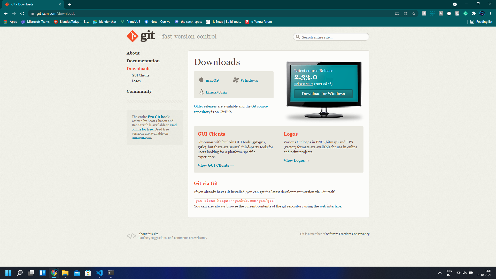
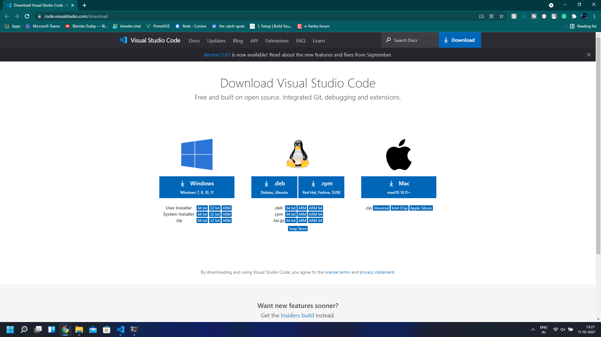
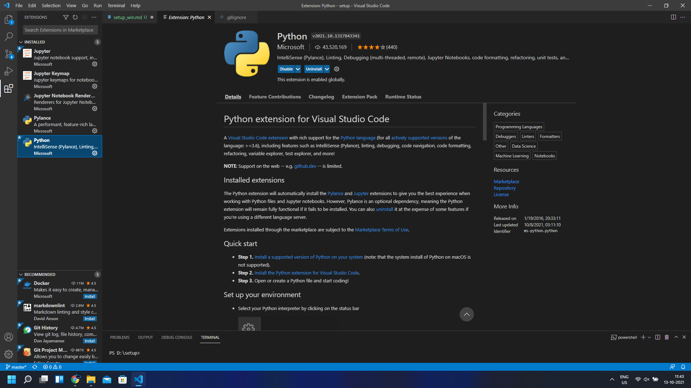
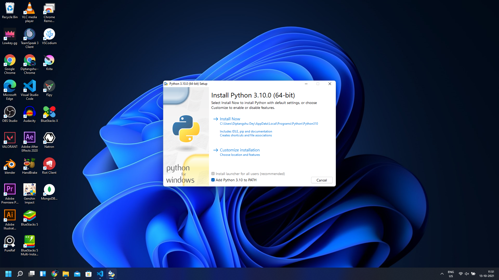
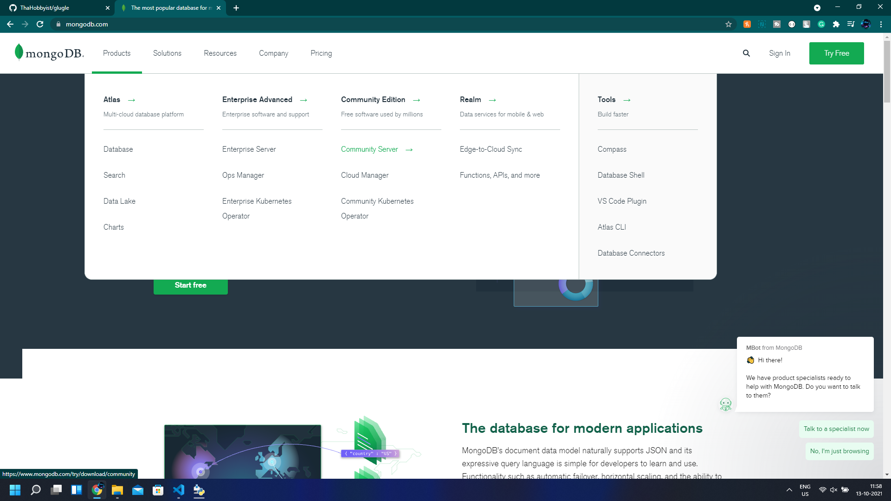
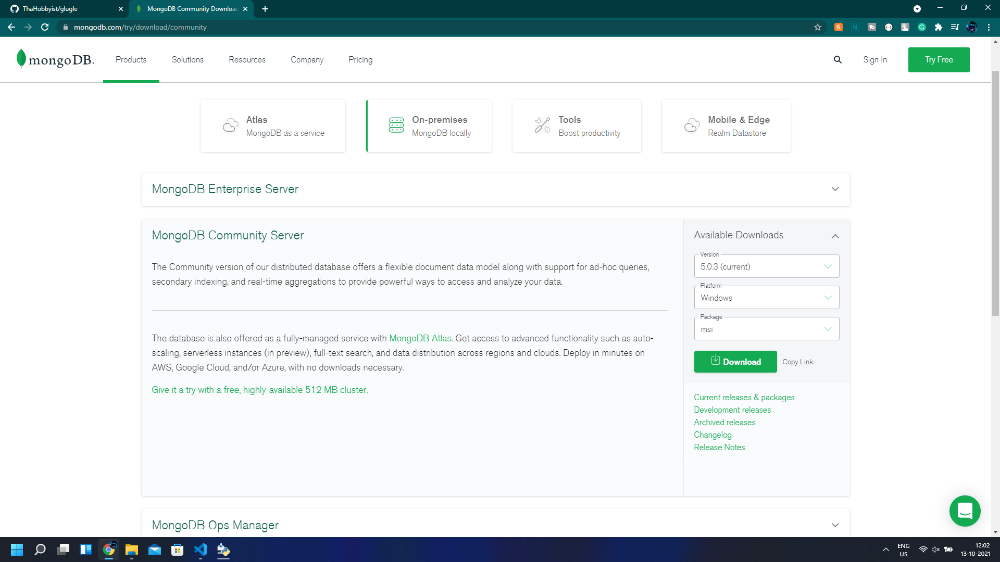
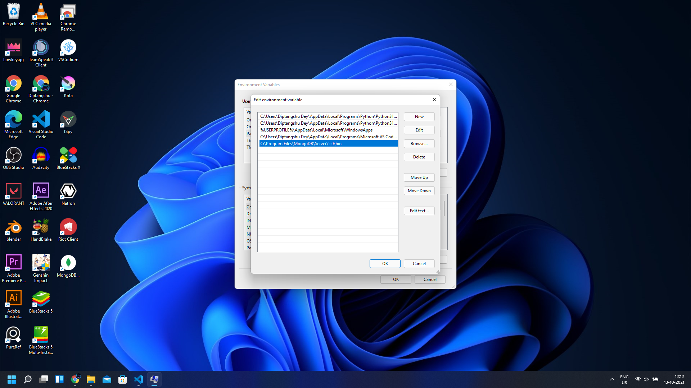

# **Project Setup in Windows**

The basic requirements for this project are:
1. Git
2. A Text Editor
3. Python
4. MongoDB

## **Git installation**

1. Go to the git [downloads](https://git-scm.com/downloads) page

2. Download the installer for windows and run it.
3. Keep everything at default and finish the installation.

## **Text Editor**

A text editor is needed to write the actual code. There are many good text editors and IDEs like [Notepad++](https://notepad-plus-plus.org/downloads/), [Visual Studio Code](https://code.visualstudio.com/download), [PyCharm](https://www.jetbrains.com/pycharm/download/#section=windows), [Atom](https://atom.io/), [Sublime Text Editor](https://www.sublimetext.com/). For this project, we will use Visual Studio Code.

1. Go to the Visual Studio Code [download](https://code.visualstudio.com/download) page.

2. Select the correct version according to your Operating System and download the installer.

3. Run the installer and install visual studio code with the default options.

4. In Visual Studio Code, install the python extension from the extension marketplace. 

## **Python**

1. Go to the python [downloads](https://www.python.org/downloads/) page.
2. Download the latest version of python available in the site and run it.
3. Check the 'ADD PYTHON 3.10 TO PATH' option.

4. Click on 'Install Now'

## **MongoDB**

1. Go to the mongodb [website](https://www.mongodb.com/) and under the products tab go to the community server section.

2. Select the latest version, and your platform i.e. Windows and the file type(.msi) and download it. 

3. Run the installer. Keep the default settings and complete the installation.

4. Now go to System properties and select 'Environment variables'. Select path and Click on 'Edit'

5. Click on 'New' and add the path to the 'bin' folder of your mongodb installation. If default settings are kept, the path should be 'C:\Program Files\MongoDB\Server\5.0\bin'.

6. Save it and mongodb installation is complete.

