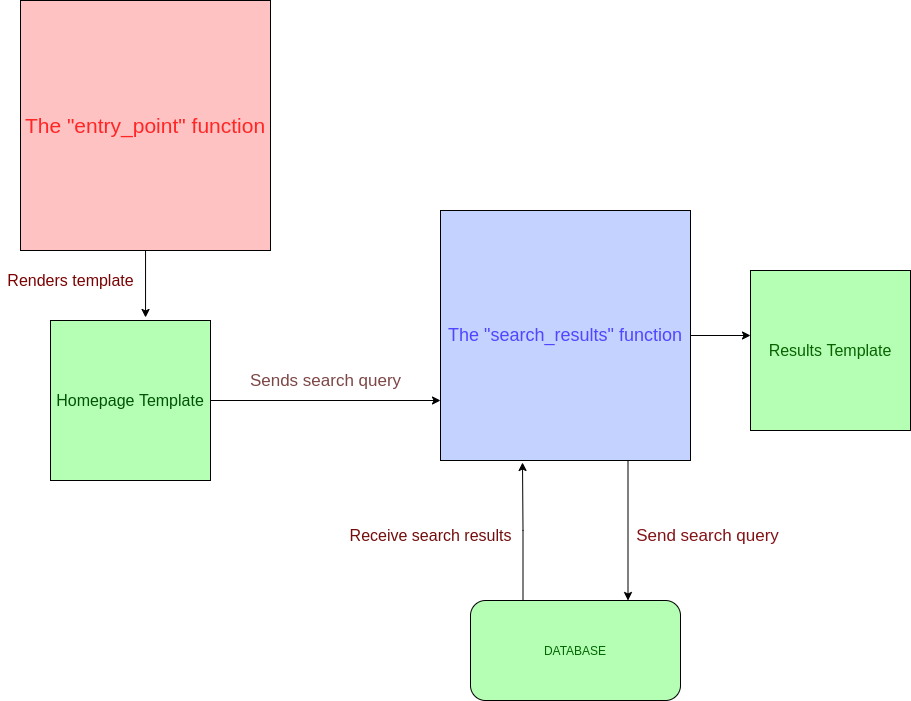

# **The Web App**

We are going to make the web app using [flask library](https://www.youtube.com/watch?v=Z1RJmh_OqeA&ab_channel=freeCodeCamp.org) in python.
There will be two pages one the homepage and the other the search results page.

## Basic structure of the web application:

The application consists of two functions. 

- The entry_point function which is present at route “/” and it’s only purpose is to render the homepage template. The homepage template is a form with an input field and a submit button which redirects you to the search_results function with the input data.
- The search_results function performs most of the task of the application. The tasks it performs are listed below:
    - It connects to mongodb where data collected by crawler is stored using the connection url.
    - It gets the search query in a variable named “search_string” from request.args
    - It then performs a search in [mongodb](https://docs.mongodb.com/manual/text-search/) for results matching the “search_string” and stores them in a variable named “query”.
    - It may be possible that there are duplicate results in the list “query”. So we need to filter them out and store the other result in a new list “search_result” which we will pass to the template for displaying to the user. Hence all the results in the “query” variable are iterated over and if a result with same title and url is found to be already present in “search_result” we don’t add them to “search_result”
    - Ranking the “search_result” according to the search query is also done in the search_results function which is discussed later.
    - Pagination of the results can be done using the [flask-paginate](https://pythonhosted.org/Flask-paginate/) library.
    - Finally the list “search_result” is passed to the template “search.html” where it is displayed.

## The Templates:
The templates used in the project are written in jinja2 language. A quick guide to the language can be found [here](https://realpython.com/primer-on-jinja-templating/).
